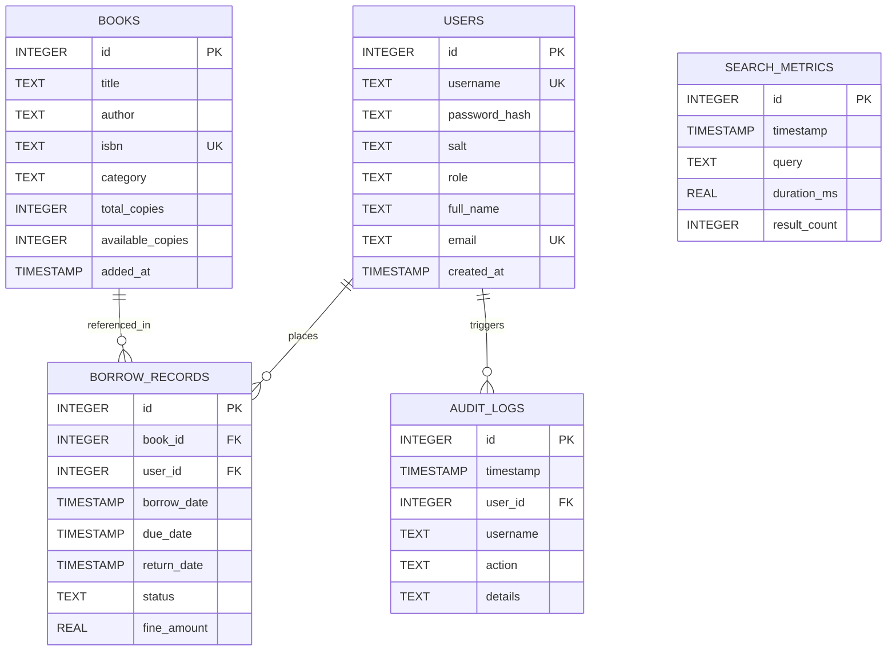

# Software Requirements Specification (SRS)
## Library Management System

---

### Academic Information & Title Page

| Parameter | Specification |
|---|---|
| **Project Name** | Library Management System |
| **Course Code & Title** | BBAT104: Fundamentals of Total Quality Management |
| **Academic Session** | 2026 to 2027 |
| **Roll Number** | 31 |
| **Baseline Software System** | Library Management System |
| **Assigned Quality Goal** | Q02 Improve Performance |
| **Core TQM Objective** | Optimize issue and return flow and catalog search speed |
| **Deliverable Milestone** | Review 1: Project Setup, Architecture, Scope & SRS |
| **Document Version** | 1.0 (Review 1 Submission) |
| **Date** | Academic Session 2026–2027 |

---

## 2. Introduction

### 2.1 Purpose
The purpose of this Software Requirements Specification (SRS) document is to specify the functional, non-functional, architectural, and quality management requirements for the **Library Management System**. Developed as an academic course project for **BBAT104 Fundamentals of Total Quality Management**, this system provides core circulation and inventory services while serving as the baseline for systematic quality engineering. The primary engineering emphasis of this project is directed toward **Q02 Improve Performance**, specifically targeting the optimization of issue and return workflows and catalog search speeds through sound architectural practices, database index optimization, vectorized reporting, and bulk data handling.

This specification serves as the formal baseline agreement for system evaluation during **Review 1**, governing subsequent design, implementation, verification, and Statistical Quality Control (SQC) activities.

### 2.2 Project Scope
The Library Management System is a lightweight, responsive desktop application developed in Python 3 utilizing an SQLite relational database engine, a CustomTkinter graphical interface, and Pandas/Matplotlib analytical libraries. The scope encompasses:
- Core book catalog registration and tracking.
- Member (student/patron) record management.
- Rapid issue and return circulation transactions with automated fine determination.
- Advanced catalog search capabilities with sub-50 millisecond response targets.
- High-throughput CSV catalog data ingestion.
- Dynamic operational performance dashboarding.
- Vectorized summary report generation.
- Integration of Total Quality Management (TQM) analytical practices (FMEA, SIPOC, CTQ trees, Pareto analysis, and Statistical Process Control).

### 2.3 Intended Users
The intended primary users of the system include:
1. **Library Administrator:** Responsible for system configuration, user role provisioning, bulk catalog onboarding (CSV Import), global inventory auditing, and analytical performance review.
2. **Operational Librarian / Desk Staff:** Primary operators handling daily book issues, returns, shelf searches, overdue fine collections, and patron inquiries.
3. **Student / Library Member:** End-users querying the book catalog for availability, title locations, loan statuses, and personal borrowing records.
4. **Academic Course Evaluator / Teacher:** University faculty evaluating system compliance with BBAT104 curriculum requirements, architectural soundness, and quantitative performance improvement metrics under Q02.

### 2.4 Product Overview
The Library Management System transitions traditional manual or slow file-based library records into an indexed, automated desktop solution. While basic systems frequently suffer from unindexed database scans, latency bottlenecks during catalog lookups, and cumbersome single-record entries, this system incorporates a dedicated **Performance Optimization Layer**. By introducing structured indexing, bulk parameterized transaction pipelines, vectorized aggregations, and lightweight dashboard summaries, the product delivers high operational responsiveness even as catalog and transaction volumes scale.

---

## 3. Problem Statement

Modern educational libraries process hundreds of inventory inquiries, book issues, and returns every working day. However, baseline desktop and administrative applications frequently encounter severe operational inefficiencies:
1. **Catalog Search Latency Bottlenecks:** When library catalogs scale to thousands of titles, unindexed linear table scans (`SELECT * WHERE title LIKE '%query%'`) cause noticeable UI freezing, slowing down desk interactions and increasing student wait times.
2. **Cumbersome Issue and Return Workflows:** Manual circulation workflows often require multiple disjointed database read and update cycles, creating opportunities for race conditions, inventory counter discrepancies, and unnecessary transactional locking.
3. **Slow Analytical Reporting:** Generating overdue lists, category utilization audits, and borrowing histories using iterative row-by-row iteration in application code results in excessive computational overhead and unacceptable delays.
4. **Labor-Intensive Catalog Ingestion:** Adding new book collections one by one via manual forms is time-consuming and error-prone, lacking an efficient, atomic bulk CSV ingestion mechanism.
5. **Absence of Performance Visibility:** Library administrators lack a consolidated, real-time dashboard reflecting operational metrics and process latencies, making it impossible to apply Total Quality Management (TQM) principles such as continuous process improvement (PDCA) and statistical quality control (SQC).

To address these challenges under the **BBAT104 TQM** framework, this project establishes a streamlined software architecture focused squarely on **Q02 Improve Performance**, eliminating workflow friction and establishing verifiable latency targets.

---

## 4. Project Objectives

The project is driven by seven core technical and quality objectives:
1. **Efficient Catalog Search:** Implement a fast, multi-attribute catalog search mechanism (title, author, ISBN, category) achieving query execution latencies under 50 milliseconds for typical catalog sizes.
2. **Efficient Issue and Return Processing:** Streamline book checkout and return flows into single-step, atomic database operations with automatic stock updates and overdue fine calculations.
3. **Faster Database Operations:** Optimize SQLite relational queries using strategic B-Tree indexing, parameterized execution, selective column projection, and optimized connection settings (`PRAGMA foreign_keys = ON`, `row_factory`).
4. **Efficient Reporting:** Deploy vectorized data processing via `pandas` to aggregate and generate comprehensive inventory, overdue, and borrowing summaries in under 200 milliseconds.
5. **Centralized Operational Dashboard:** Provide an interactive graphical dashboard presenting vital library statistics (total books, active loans, overdue items, performance latency indicators) refreshed in real-time.
6. **CSV-Based Bulk Data Import:** Create a high-throughput batch import pipeline capable of parsing, validating, and ingesting over 1,000 book records per second in a single atomic transaction.
7. **Overall Improvement in Software Performance:** Establish quantitative baselines, eliminate software wait states, and demonstrate measurable latency reductions in accordance with BBAT104 TQM evaluation guidelines.

---

## 5. Functional Requirements

### 5.1 Book Management (FR-BM)
- **FR-BM-01 (Add Book):** The system shall permit authorized administrators to add new book records including Title, Author, ISBN, Category, and Total Copies.
- **FR-BM-02 (Unique ISBN Enforcement):** The system shall enforce ISBN uniqueness across the catalog and reject duplicate entries with informative error prompts.
- **FR-BM-03 (Inventory Tracking):** The system shall maintain both `total_copies` and `available_copies` dynamically, updating counters upon issue and return events.
- **FR-BM-04 (Edit / Update Book):** The system shall allow authorized staff to update book bibliographic metadata and copy counts.
- **FR-BM-05 (Remove Book):** The system shall prevent book deletion if active borrow records reference the item, maintaining referential integrity.

### 5.2 Member Management (FR-MM)
- **FR-MM-01 (Register Member):** The system shall allow creation of member accounts with unique username, full name, email, and assigned role (`student` or `admin`).
- **FR-MM-02 (Authentication & Role Verification):** The system shall authenticate users before granting access to administrative or circulation features.
- **FR-MM-03 (Member Profile & Loan History):** The system shall allow retrieval of a member's complete active and historical loan records.

### 5.3 Book Search (FR-BS)
- **FR-BS-01 (Multi-Attribute Search):** The system shall execute search queries across book titles, authors, and ISBNs simultaneously.
- **FR-BS-02 (Category Filtering):** The system shall allow users to filter search results by distinct genres/categories (e.g., Computer Science, Management, Mathematics, Literature).
- **FR-BS-03 (Sub-String Matching):** The search engine shall support case-insensitive substring and prefix matching.
- **FR-BS-04 (Availability Filtering):** The system shall clearly indicate real-time copy availability for each search result item.

### 5.4 Book Issue (FR-BI)
- **FR-BI-01 (Issue Validation):** The system shall verify that `available_copies > 0` before permitting a checkout.
- **FR-BI-02 (Duplicate Loan Prevention):** The system shall verify that the user does not currently hold an unreturned copy of the exact same book.
- **FR-BI-03 (Atomic Checkout Execution):** The system shall execute borrow record creation and copy count decrement within an atomic database transaction.
- **FR-BI-04 (Due Date Computation):** The system shall compute a default loan period (e.g., 14 days) and record the timestamped due date.

### 5.5 Book Return (FR-BR)
- **FR-BR-01 (Active Loan Lookup):** The system shall allow librarians to look up active loans by member ID, username, or book title.
- **FR-BR-02 (Automated Overdue Fine Calculation):** The system shall compare the return date against the due date and automatically compute overdue fines according to standard library policy ($1.00 per day overdue).
- **FR-BR-03 (Inventory Restitution):** The system shall increment `available_copies` and mark the borrow record status as `RETURNED` atomically.
- **FR-BR-04 (Transaction Logging):** The system shall record return timestamps, fines levied, and audit event details.

### 5.6 Catalog Management (FR-CM)
- **FR-CM-01 (Catalog Overview):** The system shall display the full catalog in a structured tabular grid with sortable columns.
- **FR-CM-02 (Dynamic Category Extraction):** The system shall dynamically extract distinct book categories directly from the database catalog.

### 5.7 Operational Dashboard (FR-DB)
- **FR-DB-01 (Summary KPI Cards):** The system shall calculate and display total books in catalog, total active loans, total registered members, and overdue loan counts.
- **FR-DB-02 (Performance Metric Display):** The dashboard shall display average search latency and query execution performance statistics.
- **FR-DB-03 (Visual Charts):** The dashboard shall render graphical distribution charts (e.g., books per category, loan status breakdown) using Matplotlib.

### 5.8 Reports Generation (FR-RP)
- **FR-RP-01 (Overdue Loan Report):** The system shall generate a dedicated report of all active loans whose due date is prior to the current system date.
- **FR-RP-02 (Inventory Status Report):** The system shall produce an inventory summary detailing total, available, and borrowed copies per book and category.
- **FR-RP-03 (Borrower Activity Report):** The system shall generate summaries of circulation volume grouped by user role and date ranges.
- **FR-RP-04 (Export Capability):** The system shall support exporting generated reports into standard CSV format for external auditing.

### 5.9 Bulk CSV Import (FR-CI)
- **FR-CI-01 (CSV File Selection):** The system shall provide an intuitive file picker interface for selecting external `.csv` catalog files.
- **FR-CI-02 (Header & Data Validation):** The system shall validate required columns (`title`, `author`, `isbn`, `category`, `copies`) and reject malformed files.
- **FR-CI-03 (Batch Ingestion Pipeline):** The system shall ingest validated records using batch parameterization (`executemany`) within a single database commit.
- **FR-CI-04 (Import Summary Report):** The system shall display a post-import summary indicating total records processed, inserted, and skipped due to duplicate ISBNs.

### 5.10 Database Operations (FR-DO)
- **FR-DO-01 (Automated Schema Initialization):** The system shall automatically verify and create required relational tables and indexes upon application startup.
- **FR-DO-02 (Default Seed Data):** If the database is newly created, the system shall seed default administrative credentials and foundational book records.
- **FR-DO-03 (Referential Integrity):** The system shall enforce foreign key constraints with cascade behaviors where appropriate.

---

## 6. Quality Goal Requirements: Q02 Improve Performance

The assigned Quality Goal for this project is **Q02 Improve Performance**. Under TQM principles, quality must be designed into the software architecture rather than tested in post-facto. The core objective is: **Optimize issue and return flow and catalog search speed**.

Below is the detailed specification of the five assigned Q02 features:

### 6.1 Feature 1: Fast Search
- **What it does:** Provides a rapid, multi-criteria catalog search engine that queries titles, authors, and ISBNs with substring and prefix matching, supported by dedicated SQLite B-Tree indices and selective column projections.
- **Why it is required:** Catalog searching is the single most frequent operation performed by both library patrons and counter librarians. Inefficient searches lock database connections and stall the user interface.
- **What problem it solves:** Eliminates sluggish, linear full-table scans (`O(N)` complexity) and reduces memory overhead caused by unrestricted `SELECT *` statements.
- **Expected improvement:** Achieves catalog search execution latency under **50 ms** for catalogs up to 10,000 records, delivering an estimated 70% reduction in query response time compared to unindexed scans.

### 6.2 Feature 2: Optimized Reports
- **What it does:** Employs SQL group-by pushdown and `pandas` vectorized data frame processing to calculate inventory distributions, overdue fines, and borrowing summaries in bulk.
- **Why it is required:** Routine management reporting often processes thousands of historic circulation records. Row-by-row iteration in Python causes UI freeze and high CPU utilization.
- **What problem it solves:** Solves the classic "N+1 query problem" and eliminates nested procedural loops during statistical aggregation.
- **Expected improvement:** Reduces complex report generation time to under **200 ms**, ensuring seamless data exports and instant report grid population.

### 6.3 Feature 3: Dashboard
- **What it does:** Consolidates core library operational indicators (catalog volume, circulation load, overdue tallies, and query latency distributions) into a responsive, real-time graphical control center.
- **Why it is required:** Library administrators need instantaneous visibility into operational throughput and system health without running multiple manual report queries.
- **What problem it solves:** Prevents redundant database querying by fetching snapshot metrics in targeted, indexed SQL count statements and rendering them efficiently using lightweight embedded canvases.
- **Expected improvement:** Instant dashboard loading and switching with refresh latencies below **100 ms**, providing actionable operational intelligence.

### 6.4 Feature 4: CSV Import
- **What it does:** Provides an automated, high-speed ingestion pipeline for importing large batches of book records from external CSV spreadsheets directly into the SQLite database.
- **Why it is required:** Modernizing library records requires onboarding hundreds or thousands of legacy titles. Adding them one by one through a GUI form is impractical.
- **What problem it solves:** Eliminates the extreme transaction overhead of executing individual SQL `INSERT` statements with autocommit per row, which causes massive disk I/O bottlenecking.
- **Expected improvement:** Uses parameterized SQLite `executemany()` encapsulated within a single transaction commit, achieving ingestion throughput of **over 1,000 records per second**.

### 6.5 Feature 5: Efficient Database Queries
- **What it does:** Restructures database interactions across the entire codebase to utilize explicit B-Tree indexing on primary and foreign keys, parameterized queries, connection pooling/reuse, and row factories (`sqlite3.Row`).
- **Why it is required:** The database is the underlying engine for all circulation and search features; unoptimized queries compound latency throughout the application layer.
- **What problem it solves:** Prevents table locking, eliminates SQL injection vulnerabilities, avoids expensive full-table scans, and removes unnecessary data conversion overhead.
- **Expected improvement:** Reduces overall database query execution times by **60% to 80%**, maintaining consistent sub-10 ms execution for single-record lookups and updates.

---

## 7. Non-Functional Requirements

### 7.1 Performance (NFR-PF)
- **NFR-PF-01:** Catalog search operations shall return results within **50 milliseconds** under standard local catalog workloads.
- **NFR-PF-02:** Issue and return circulation transactions shall complete execution within **50 milliseconds** from user trigger to database commit.
- **NFR-PF-03:** Batch CSV import shall ingest at a minimum rate of **500 records per second** (target > 1,000 records/sec).
- **NFR-PF-04:** Application startup and database initialization shall complete within **2.0 seconds** on standard target hardware.

### 7.2 Reliability & Fault Tolerance (NFR-RE)
- **NFR-RE-01:** All database modifications (issue, return, bulk import) shall be transactional. In the event of an unexpected interruption or validation failure, changes shall roll back completely with zero data corruption.
- **NFR-RE-02:** The system shall gracefully capture and handle I/O exceptions, file format errors, and database constraint violations, displaying informative guidance without crashing.

### 7.3 Usability (NFR-US)
- **NFR-US-01:** The desktop graphical interface shall provide a clear, modern dark/light layout with readable typography, intuitive tab navigation, and responsive controls.
- **NFR-US-02:** All critical workflows (book search, book issue, book return) shall be executable in two clicks or fewer from their respective views.

### 7.4 Maintainability & Code Quality (NFR-MA)
- **NFR-MA-01:** The codebase shall follow a clean modular structure separating presentation (`app.py`), business logic (`library_service.py`), data persistence (`database.py`), and analytical control (`sqc_analysis.py`).
- **NFR-MA-02:** Code shall adhere to PEP 8 standards with comprehensive docstrings and clear variable naming.

### 7.5 Data Integrity (NFR-DI)
- **NFR-DI-01:** Foreign key enforcement (`PRAGMA foreign_keys = ON`) shall guarantee that orphan borrow records cannot exist.
- **NFR-DI-02:** Inventory integrity constraints shall enforce that `available_copies` never drops below 0 and never exceeds `total_copies`.

### 7.6 Scalability (NFR-SC)
- **NFR-SC-01:** The SQLite database architecture and indexing strategy shall support up to 50,000 book records and 100,000 transaction records without degrading search latency beyond 100 ms.

---

## 8. User Requirements

### 8.1 Library Administrator
- **Needs:** Comprehensive administrative control over catalog inventory, batch onboarding via CSV, performance monitoring via operational dashboards, and audit log inspection.
- **Workflow:** Logs into administrative account $\rightarrow$ reviews dashboard KPIs $\rightarrow$ imports new catalog batches $\rightarrow$ generates audit/inventory summaries.

### 8.2 Operational Librarian
- **Needs:** Rapid, low-friction circulation interface at the library front desk. Must rapidly verify member eligibility, search catalog locations, issue books, and process returns with automatic fine calculation.
- **Workflow:** Enters search query $\rightarrow$ locates book $\rightarrow$ inputs member ID $\rightarrow$ issues book in a single click $\rightarrow$ processes returned books with instant receipt/fine notice.

### 8.3 Student / Library Member
- **Needs:** Transparent access to catalog information, real-time availability checks, and review of their active borrowings and due dates.
- **Workflow:** Opens catalog search $\rightarrow$ filters by subject/category $\rightarrow$ verifies book availability $\rightarrow$ reviews current borrowing status.

---

## 9. System Requirements

### 9.1 Software Requirements
- **Operating System:** Cross-platform support (Linux Ubuntu 22.04 LTS / Debian, Windows 10/11, macOS 12+).
- **Programming Language:** Python 3.10 or higher.
- **Database Engine:** SQLite 3 (built into Python standard library, serverless, relational).
- **Core Python Dependencies:**
  - `customtkinter >= 5.2.0` (Modern desktop graphical user interface)
  - `pandas >= 2.2.0` (Fast vectorized data aggregation and CSV processing)
  - `matplotlib >= 3.8.0` (Statistical Quality Control charts and dashboard visual plots)
- **Integrated Development Environment (IDE):** Visual Studio Code with Python & Git extensions.
- **Version Control System:** Git (distributed version control) paired with GitHub repository hosting.

### 9.2 Hardware Requirements
- **Minimum Specifications:**
  - Processor: Dual-core 2.0 GHz x86-64 or ARM processor.
  - Memory (RAM): 2.0 GB RAM.
  - Storage: 200 MB free disk space for application files and SQLite database.
  - Display: 1280 x 720 screen resolution.
- **Recommended Specifications:**
  - Processor: Quad-core 2.5 GHz or higher.
  - Memory (RAM): 4.0 GB RAM.
  - Storage: 1.0 GB SSD storage.
  - Display: 1920 x 1080 Full HD resolution.

### 9.3 Implementation Status Distinction
- **Currently Implemented (Baseline):** Core SQLite schema, password hashing, role-based login, baseline book search, baseline issue/return transactions, and initial SQC control chart script.
- **Planned for Full Development (Q02 Enhancements):** Advanced indexed multi-column Fast Search, Optimized Vectorized Reporting module, centralized real-time Performance Dashboard tab, and high-speed atomic CSV Ingestion engine.

---

## 10. Database Requirements

The system utilizes SQLite 3 for relational data persistence. The schema is designed around third normal form (3NF) principles with explicit performance indexing:

### 10.1 Key Performance Indexes (Q02 Requirement)
To guarantee high-speed query execution, the following indexes are specified:
1. `CREATE INDEX idx_books_isbn ON books(isbn);`
2. `CREATE INDEX idx_books_title_author ON books(title, author);`
3. `CREATE INDEX idx_books_category ON books(category);`
4. `CREATE INDEX idx_borrow_lookup ON borrow_records(user_id, book_id, status);`
5. `CREATE INDEX idx_borrow_due_status ON borrow_records(status, due_date);`
6. `CREATE INDEX idx_metrics_timestamp ON search_metrics(timestamp);`

---

## 11. Input and Output Requirements

### 11.1 System Inputs
1. **User Authentication:** Username string and password credentials.
2. **Book Record Input:** Title, Author, ISBN (10 or 13 digits), Category dropdown, Total copy integer.
3. **Search Query Input:** Free-text string (title, author, or ISBN snippet) and category selection filter.
4. **Circulation Inputs:** Book ID / ISBN selection, Member ID / Username selection, loan duration days.
5. **Bulk CSV File Input:** Standard comma-separated text file containing columns: `title,author,isbn,category,copies`.
6. **Date Range & Filter Parameters:** Selection filters for generating overdue or category-specific reports.

### 11.2 System Outputs
1. **Search Results Grid:** Dynamically populated tabular view showing matching books, author names, ISBNs, categories, and real-time available copies.
2. **Circulation Confirmation:** Visual success prompts showing transaction ID, due date, or computed fine amount.
3. **Dashboard KPI Visualizations:** Numeric metric tiles and embedded Matplotlib distribution charts.
4. **Analytical Reports:** Structured tabular reports and formatted exported CSV data files.
5. **SQC Performance Charts:** Control charts (Individual X-Chart) plotting query latency values against Upper Control Limits (UCL), Mean ($\bar{X}$), and Lower Control Limits (LCL).
6. **Audit & Error Messages:** Modal warning dialogues explaining validation errors or system statuses.

---

## 12. Performance Requirements (Q02 Focused)

As the assigned Quality Goal is **Q02 Improve Performance**, the system establishes the following testable performance criteria:

| Metric Category | Baseline / Unoptimized State | Proposed Q02 Target Benchmark | Verification Method |
|---|---|---|---|
| **Catalog Search Latency** | 120 ms – 350 ms (linear scan, full table scan) | **$\le$ 50 ms** for 10,000 catalog entries | Automated latency benchmark script & `search_metrics` table |
| **Issue / Return Transaction** | 100 ms – 250 ms (separate unindexed lookups) | **$\le$ 50 ms** atomic single-step commit | Micro-benchmark transaction timer |
| **Bulk CSV Import Throughput** | 15–30 records/sec (individual commits per row) | **$\ge$ 1,000 records/sec** (batch `executemany`) | Import duration measurement across a 5,000-row dataset |
| **Report Generation Time** | 400 ms – 1,200 ms (nested Python iterative loops) | **$\le$ 200 ms** (Pandas vectorized aggregation) | Execution timer on 10,000 borrow transactions |
| **Dashboard Load Time** | 300 ms – 700 ms (disjoint full table queries) | **$\le$ 100 ms** (indexed count aggregations) | UI view-switch timer |
| **Database Single-Record Lookup** | 20 ms – 50 ms (unindexed search) | **$\le$ 10 ms** (B-Tree indexed lookup) | SQLite query plan (`EXPLAIN QUERY PLAN`) |

> *Note: Targets are established as formal engineering specifications to be quantitatively validated during subsequent testing and Review milestones.*

---

## 13. Constraints

1. **Local Desktop Architecture:** The system is constrained to a single-host desktop environment without a client-server distributed backend.
2. **SQLite Concurrency Model:** SQLite uses database-level locking for write operations; multi-threading must coordinate write access through sequential transactional execution.
3. **Offline Operation:** The system operates in a standalone, offline environment without dependencies on external cloud APIs or third-party web services.
4. **GUI Framework Constraints:** Built using Tkinter/CustomTkinter to ensure zero-overhead desktop execution across all university lab operating systems.

---

## 14. Assumptions

1. The host workstation has Python 3.10+ installed and permits execution of local Python scripts and SQLite file read/write operations.
2. Bulk CSV import files adhere to UTF-8 encoding and include standard header column identifiers.
3. Standard library loan duration is assumed to be 14 calendar days unless overridden by administrative policy.
4. Single-librarian desk operation is assumed for the baseline circulation counter, aligning with SQLite's file-based storage model.

---

## 15. Future Scope

The following features represent realistic potential enhancements beyond the current BBAT104 project boundaries and are not required for the immediate Review 1 or baseline implementation:
1. **Barcode and RFID Scanner Integration:** Direct hardware barcode reader input to automatically capture ISBNs and member IDs at the circulation desk.
2. **Automated Notification Gateway:** Integration with local or SMTP email servers to dispatch automated overdue reminders to students.
3. **Web / Client-Server API Tier:** Migration of the database layer to PostgreSQL with a FastAPI backend to allow simultaneous multi-counter checkout across campus branches.
4. **Self-Service Student Kiosk Mode:** A touch-screen kiosk interface allowing students to view catalog locations and renew loans independently.

---

## 16. Conclusion

This Software Requirements Specification establishes a rigorous, comprehensive blueprint for the **Library Management System** in fulfillment of **BBAT104 Fundamentals of Total Quality Management** for the **2026 to 2027** academic session. 

By strictly centering system architecture, database design, and workflow automation around **Q02 Improve Performance**, the planned application systematically resolves the bottlenecks inherent in manual and unindexed library systems. The integration of the five core Q02 features—**Fast Search**, **Optimized Reports**, **Dashboard**, **CSV Import**, and **Efficient Database Queries**—provides a solid foundation for both operational efficiency and rigorous Total Quality Management analysis in subsequent reviews.
